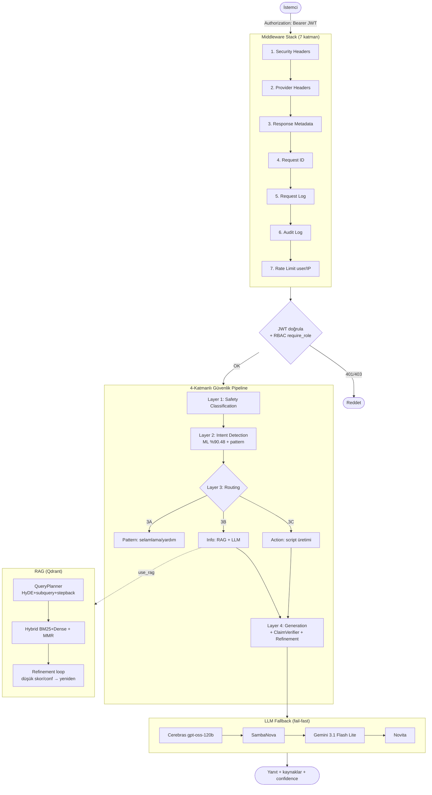

# AI-Powered OS Hardening

**RAG + LLM Based Operating System Security Hardening Assistant**

*Marmara Üniversitesi — Bilgisayar Mühendisliği Bitirme Projesi*

---

## Executive Summary

CIS Benchmark dokümanları, NIST 800-207 ve ISO 27001 üzerinde RAG ile semantik arama yapıp,
LLM ile işletim sistemi sıkılaştırma önerileri ve uygulanabilir hardening script'leri üreten
yapay zekâ destekli karar-destek sistemi. Güvenlik uzmanlarına hızlı, kaynak-temelli ve
denetlenebilir bilgi sunar.

### Key Features

- **4-Katmanlı Güvenlik Pipeline'ı**: Safety Classification → Intent Detection → Routing → Generation
- **JWT Auth + RBAC + Audit**: JWT (HS256) kimlik doğrulama, 4 rol (sysadmin/security/developer/end_user), SQLite audit log, kullanıcı-bazlı rate limit
- **Çok-sağlayıcılı LLM**: **Cerebras** `gpt-oss-120b` (primary, ücretsiz) → SambaNova → Gemini 3.1 Flash Lite (OpenRouter) → Novita; **fail-fast fallback** (`max_retries=0`)
- **Gelişmiş RAG**: Hybrid BM25+Dense (RRF), MMR reranking, QueryPlanner (HyDE + subquery + stepback paralel), FilterAgent (OS/rol çıkarımı), **çift refinement loop** (retrieval-skoru + cevap-groundedness)
- **Embedding**: Novita `qwen/qwen3-embedding-8b` (4096 dim)
- **ML Intent Detection**: 1.677 örnek, %90.48 accuracy, <10ms, yerel inference ($0)
- **Rule Engine + Artifact Generator**: Ubuntu 24.04 (312 kural) + Windows 11 (516 kural); bash/PowerShell/Ansible/REG/GPO üretimi
- **Gerçek SSE Streaming**: Token-bazlı canlı akış
- **Monitoring**: Prometheus `/metrics/prometheus`, OpenTelemetry/Jaeger, per-step timing

### Performance Highlights (ölçülen)

| Metric | Value | Details |
|--------|-------|---------|
| **ML Intent Detection** | **%90.48** test accuracy | 1.677 örnek, 7 kategori |
| **Cross-Validation** | %82.10 (±3.46%) | 5-fold CV |
| **Tek LLM çağrısı** | **~1.36s** | Cerebras gpt-oss-120b (özel donanım) |
| **Agent plan / harden (medyan)** | **~3.55s / ~4.62s** | H3 hedefi <5sn — çözüldü (eski ~128-148s) |
| **RAG retrieval** | ~1-2.5s | Qdrant embed + hybrid + MMR |
| **İP-5 groundedness** | 0.81 (somut Q/A 0.89) | ClaimVerifier |
| **Maliyet** | ~$0 | Cerebras ücretsiz tier (1M token/gün) |
| **Birim test** | 516 geçiyor | + service-free integration |

> H1/H3 ölçüm detayları: [docs/14_DEGERLENDIRME.md](docs/14_DEGERLENDIRME.md)

---

## Quick Start

```bash
# 1. Ortam değişkenlerini doldur
cp .env.example .env
# CEREBRAS_API_KEY, SAMBANOVA_API_KEY, OPENROUTER_API_KEY (Gemini için),
# NOVITA_API_KEY (embedding), QDRANT_URL, QDRANT_API_KEY, REDIS_URL,
# ve JWT_SECRET (>=32 karakter; boşsa dev-mode demo hesapları seed'lenir)

# 2. Docker ile başlat (önerilen)
docker compose up -d

# 3. Giriş yap → JWT al
curl -X POST http://localhost:8000/auth/login \
  -H "Content-Type: application/json" \
  -d '{"username": "admin", "password": "changeme123"}'   # dev demo hesabı

# 4. Token ile chat
curl -X POST http://localhost:8000/api/chat \
  -H "Content-Type: application/json" \
  -H "Authorization: Bearer <TOKEN>" \
  -d '{"question": "Ubuntu 24.04 SSH hardening nasıl yapılır?", "use_rag": true}'
```

**API**: http://localhost:8000 · **Swagger UI**: http://localhost:8000/docs · **Health**: http://localhost:8000/health

> **Auth notu:** `JWT_SECRET` ayarlı değilse dev-mode aktiftir ve 4 demo hesap (`admin`/`sec`/`dev`/`user`, parola `changeme123`) otomatik oluşturulur. Production'da `JWT_SECRET` ayarlayın.

---

## Architecture



Detaylı mimari: [docs/02_PIPELINE_VE_ROUTELAR.md](docs/02_PIPELINE_VE_ROUTELAR.md) · [docs/10_ARCHITECTURE_ANALYSIS.md](docs/10_ARCHITECTURE_ANALYSIS.md)

---

## Project Structure

```
ai-powered-os-hardening/
├── api/                              # FastAPI router'lar, middleware, auth
│   ├── router_chat.py                # /api/chat (+ /chat/stream SSE)
│   ├── router_agent.py               # /api/agent/plan, /api/agent/harden (İP-6/7)
│   ├── router_artifacts.py           # /api/rules/*, /api/artifacts/generate
│   ├── router_rag.py                 # /rag/search
│   ├── router_auth.py                # /auth/login, /auth/logout, /auth/me
│   ├── auth.py                       # JWT + get_current_user + require_role (RBAC)
│   ├── auth_store.py / auth_models.py / auth_blacklist.py / db.py  # users + bcrypt + jti blacklist + SQLite
│   ├── audit.py                      # Audit log (SQLite) + AuditMiddleware + /api/audit
│   ├── security.py                   # Rate limit (user/IP), input validation, sanitization
│   └── errors.py / middleware.py / metrics.py
├── llm/
│   ├── pipelines/
│   │   ├── secure_v2.py              # Ana 4-katmanlı pipeline (SecurePipelineV2)
│   │   └── layers/                   # safety / intent / pattern / info / action pipeline
│   ├── clients/                      # LLM istemcileri + registry + FallbackLLM
│   │   ├── openai_compatible_client.py   # Cerebras/SambaNova/Gemini (generic)
│   │   ├── novita_llm_client.py / registry.py / __init__.py
│   ├── agents/                       # TaskPlanner, HardeningAgent
│   ├── core/                         # config, context, session_store, redis_session_store
│   └── prompts/
├── rag/
│   ├── retrieval/ query/ verify/     # retriever, QueryPlanner/QueryRewriter/FilterAgent, ClaimVerifier
│   ├── embeddings/ vector_store/     # Novita embeddings + Qdrant
├── domain/
│   ├── rule_engine/                  # dependency resolver + conflict detector
│   └── artifact_generator/           # bash/powershell/ansible/reg/gpo
├── evaluation/                       # H1/İP-5..8 harness, load_test, provider_benchmark, survey_eval
├── data/rules/                       # ubuntu_24_04 (312) + windows_11 (516) + windows_server_2025 (boş)
├── tests/{unit,integration}/         # 516 unit test + integration
├── docs/                             # 01-16 (TR/EN dokümantasyon)
├── config/                           # config.json + schemas + loader
├── main.py                           # FastAPI entry point
└── requirements.txt
```

---

## Documentation (`docs/`)

| # | Doküman | İçerik |
|---|---------|--------|
| 01 | [Proje Özeti](docs/01_PROJE_OZETI.md) | Ne, neden, sonuçlar |
| 02 | [Pipeline & Route'lar](docs/02_PIPELINE_VE_ROUTELAR.md) | 4-katman mimari + akış |
| 03 | [Kurulum & Kullanım](docs/03_KURULUM_VE_KULLANIM.md) | Adım adım kurulum |
| 04 | [API Dokümantasyonu](docs/04_API_DOKUMANTASYONU.md) | Uçlar, auth, parametreler |
| 05 | [Teknolojiler](docs/05_TEKNOLOJILER.md) | Stack ve gerekçeler |
| 06 | [LLM Uygulamaları](docs/06_LLM_UYGULAMALARI.md) | ML intent, prompt mühendisliği |
| 07 | [RAG Sistemi](docs/07_RAG_SISTEMI.md) | Retrieval-augmented generation |
| 08 | [Test Dokümantasyonu](docs/08_TEST_DOKUMANTASYONU.md) | Test metodolojisi + sonuçlar |
| 10 | [Architecture Analysis](docs/10_ARCHITECTURE_ANALYSIS.md) | Mimari + zayıf noktalar (EN) |
| 11 | [Performance Analysis](docs/11_PERFORMANCE_ANALYSIS.md) | Performans benchmark'ları (EN) |
| 12 | [Frontend Integration](docs/12_FRONTEND_INTEGRATION.md) | React/Vue/JS + SSE (EN) |
| 13 | [Güvenlik](docs/13_GUVENLIK.md) | JWT/RBAC/Audit/rate-limit |
| 14 | [Değerlendirme](docs/14_DEGERLENDIRME.md) | İP-5/6/7/8 + H1/H3 ölçümleri |
| 15 | [Eksikler](docs/15_EKSIKLER.md) | Kalan iş listesi |
| 16 | [Kullanıcı Çalışması](docs/16_KULLANICI_CALISMASI.md) | H2/H4 anket protokolü |

---

## Technology Stack

**Backend**: FastAPI, Pydantic v2, Uvicorn, Python 3.12

**LLM Sağlayıcıları** (fail-fast fallback zinciri):
- **Cerebras** — primary, ücretsiz (`gpt-oss-120b`, özel donanım, ~1.4s)
- **SambaNova** — fallback (`gpt-oss-120b`, ~3.2s)
- **Gemini 3.1 Flash Lite** — OpenRouter üzerinden (1M context, ~3s)
- **Novita** — düşük ücretli güvenlik ağı (kotasız)
- *(Groq / Ollama / HuggingFace — DEPRECATED, otomatik zincirden çıkarıldı)*

**Embedding**: Novita `qwen/qwen3-embedding-8b` (4096 dim)

**RAG**: Qdrant Cloud (`cis_ubuntu_2404_windows11_winserver2025_with_rules`) · Hybrid BM25+Dense (RRF) · MMR · QueryPlanner · FilterAgent · çift refinement loop

**Cache / Session**: Redis (session store + JWT blacklist + rate limit; embedding cache opsiyonel/kapalı)

**Auth / Security**: JWT (PyJWT, HS256) · bcrypt · RBAC (4 rol) · SQLite (users + audit_log) · kullanıcı-bazlı rate limit · güvenlik header'ları · input validation

**ML**: Logistic Regression + TF-IDF, %90.48 accuracy, 5-10ms, $0

**Test**: pytest — 516 unit test + integration

---

## API Reference

> Tüm korumalı uçlar `Authorization: Bearer <jwt>` ister. Token için önce `POST /auth/login`.

### `POST /auth/login` (public)
```json
{ "username": "admin", "password": "changeme123" }
```
→ `{ "access_token": "...", "token_type": "bearer", "role": "sysadmin", "expires_in": 3600 }`

### `POST /api/chat` (auth: herkes)
```json
{ "question": "Ubuntu SSH portunu nasıl değiştiririm?", "os": "ubuntu_24_04", "use_rag": true }
```
Yanıt: `answer`, `intent`, `safety_category`, `layer_path`, `rag_sources[]`, `stats{}`, `verification_confidence`, `unsupported_claims[]`.

### `POST /api/chat/stream` (auth)
Gerçek SSE token akışı (`metadata` → `message`×N → `done`). EventSource için `?access_token=<jwt>` query fallback'i kabul edilir.

### Diğer (RBAC)
- `POST /api/agent/plan` (developer+), `POST /api/agent/harden` (security+)
- `POST /api/artifacts/generate`, `/api/rules/*` (developer+)
- `GET /api/audit` (security+) · `GET /health` (public)

Tam referans: çalışan sunucuda http://localhost:8000/docs

---

## Testing

```bash
python -m pytest tests/unit/         # 516 test (auth, RAG, pipeline, refinement, rule engine...)
python -m pytest tests/integration/test_router_agent.py tests/integration/test_router_artifacts.py
```

**Mevcut durum:** 516 unit test geçiyor; service-free integration (router) 18/18 geçiyor. Diğer integration dosyaları canlı Qdrant/LLM gerektirir. (`test_health_ok` yalnızca canlı Qdrant erişilemediğinde "degraded" verir.)

---

## Security

Detay: [docs/13_GUVENLIK.md](docs/13_GUVENLIK.md)

#### Uygulanan ✅
1. **JWT Authentication** — `POST /auth/login`, HS256, jti blacklist (logout)
2. **RBAC** — 4 rol (sysadmin/security/developer/end_user), uç-bazında `require_role`
3. **Audit Log** — SQLite `audit_log` (kim-ne-zaman), `AuditMiddleware` + login/logout olayları
4. **Rate Limiting** — kullanıcı-bazlı (`user:{name}`) veya IP; Redis/in-memory
5. **Input Validation** + **Output Sanitization** + **Security Headers** (CSP/HSTS/X-Frame)
6. **Provider Fallback** — fail-fast zincir
7. **Safety Classifier** — fail-closed

#### Production öncesi
- `JWT_SECRET` (>=32 char) ayarla · HTTPS/TLS · `ALLOWED_HOSTS` + spesifik CORS · Redis ayağa kaldır

---

## Changelog

### v1.3.0 — Security & Refinement (2026-05-31)
- ✅ **JWT Authentication + RBAC** (4 rol) + **Audit Log** (SQLite) + **kullanıcı-bazlı rate limit**; X-API-Key kaldırıldı
- ✅ **Cevap-groundedness refinement loop** (düşük confidence → genişlet + yeniden üret)
- ✅ Güvenlik testleri (JWT/blacklist/RBAC/audit) + refinement testleri (61 yeni test)

### v1.2.0 — LLM Stack Overhaul (2026-05-30)
- ✅ **Cerebras + SambaNova primary** (`gpt-oss-120b`) + Gemini 3.1 Flash Lite + Novita; **fail-fast fallback**
- ✅ **H3 çözüldü**: P50 ~128-148s → ~3.5-4.6s (tek çağrı ~1.36s)
- ✅ Gerçek SSE token-streaming; agent `provider`/`latency_s` metadata; İP-5/6/7/8 + H1 ölçüm harness'leri

### v1.1.0 — Enhanced RAG (2026-04-29)
- ✅ Hybrid BM25+Dense (RRF), MMR, QueryPlanner (HyDE+subquery+stepback), ClaimVerifier, retrieval-skoru refinement

### v1.0.0 (2025-12-24)
- ✅ İlk sürüm: 4-katmanlı pipeline, SSE, ML intent, RAG

---

**Marmara Üniversitesi — Bilgisayar Mühendisliği Bitirme Projesi**
**Last Updated**: 2026-05-31 · **Version**: v1.3.0 · **Status**: Demo-Ready (production için HTTPS + JWT_SECRET)
