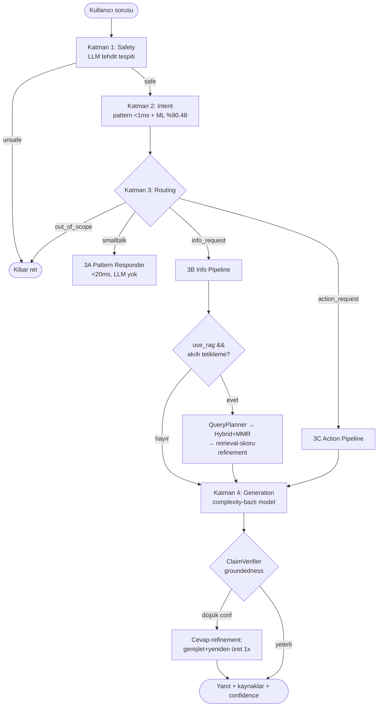

# Pipeline ve Route'lar - Sistem Nasıl Çalışır?

## Genel Bakış

AI-Powered OS Hardening sistemi, **4 katmanlı güvenlik odaklı mimari** kullanır. Her katman belirli bir görevi yerine getirir ve bir sonraki katmana geçip geçmeyeceğine karar verir.

**Önemli Not**: Sistem kullanıcıdan gelen `use_rag` parametresini kabul eder ancak **akıllı RAG tetikleme** mantığı ile son kararı otomatik verir. Generic sorular için RAG otomatik olarak skip edilir (%55 performans artışı).

> **LLM sağlayıcı notu:** Aşağıdaki şema/örneklerde geçen `Groq`/`groq.chat(...)` ifadeleri eski
> sürümden kalma **gösterim amaçlıdır**. Güncel aktif sağlayıcı **Cerebras `gpt-oss-120b`**
> (ücretsiz), fail-fast fallback zinciri: **Cerebras → SambaNova → Gemini 3.1 Flash Lite → Novita**.

### Akış Diyagramı (Mermaid)



```
┌──────────────────────────────────────────────────────────────┐
│                    KULLANICI SORUSU                           │
│         "Ubuntu 22.04 için SSH hardening scripti ver"         │
└────────────────────────┬─────────────────────────────────────┘
                         │
                         ▼
        ╔════════════════════════════════════════════╗
        ║  KATMAN 1: SAFETY CLASSIFICATION           ║
        ║  ────────────────────────────────          ║
        ║  Amaç: Tehlikeli/zararlı sorguları tespit ║
        ║  Teknoloji: LLM (Cerebras gpt-oss-120b)    ║
        ║  Süre: ~300-600ms                          ║
        ║  Maliyet: $0 (Cerebras ücretsiz tier)      ║
        ╚════════════════════════════════════════════╝
                         │
            ┌────────────┴────────────┐
            │                         │
      [UNSAFE]                   [SAFE/DEFENSIVE]
            │                         │
            ▼                         ▼
      ┌─────────┐          ╔═════════════════════════════════╗
      │ REJECT  │          ║  KATMAN 2: INTENT DETECTION     ║
      │ 1→REJECT│          ║  ────────────────────────────   ║
      └─────────┘          ║  Amaç: Kullanıcı niyeti tespit ║
                           ║  Teknoloji: ML + Pattern        ║
                           ║  Süre: <10ms                    ║
                           ║  Maliyet: $0                    ║
                           ╚═════════════════════════════════╝
                                       │
                ┌──────────────────────┼───────────────────────┬────────────┐
                │                      │                       │            │
          [SMALLTALK]          [INFO_REQUEST]         [ACTION_REQUEST]  [OUT_OF_SCOPE]
                │                      │                       │            │
                ▼                      ▼                       ▼            ▼
    ┌───────────────────┐  ╔═══════════════════╗  ╔════════════════════╗  ┌────────────┐
    │ KATMAN 3A:        │  ║ KATMAN 3B:        ║  ║ KATMAN 3C:         ║  │ OUT_SCOPE  │
    │ PATTERN HANDLER   │  ║ INFO PIPELINE     ║  ║ ACTION PIPELINE    ║  │ HANDLER    │
    │ ──────────────    │  ║ ──────────────    ║  ║ ────────────────   ║  │ ──────     │
    │ No LLM            │  ║ RAG + LLM         ║  ║ RAG + LLM + CoT    ║  │ Pattern    │
    │ Hazır yanıtlar    │  ║ Bilgi soruları    ║  ║ Script oluşturma   ║  │ Nazik red  │
    │ <1ms              │  ║ 1-2s              ║  ║ 2-3s               ║  │ <1ms       │
    │ $0                │  ║ ~$0.001           ║  ║ ~$0.002            ║  │ $0         │
    │ (1→2→3A)          │  ║ (1→2→3B→4)        ║  ║ (1→2→3C→4)         ║  │ (1→2→OUT)  │
    └───────────────────┘  ╚═══════════════════╝  ╚════════════════════╝  └────────────┘
                                      │                       │
                                      └───────────┬───────────┘
                                                  │
                                                  ▼
                                      ╔═══════════════════════╗
                                      ║  KATMAN 4:            ║
                                      ║  OUTPUT VALIDATION    ║
                                      ║  ──────────────────   ║
                                      ║  Komut güvenlik check ║
                                      ║  Regex + LLM hybrid   ║
                                      ╚═══════════════════════╝
                                                  │
                                                  ▼
                                         ┌────────────────┐
                                         │ KULLANICIYA    │
                                         │ YANIT          │
                                         └────────────────┘
```

---

## KATMAN 1: Safety Classification

### Amaç
Sisteme gelen sorguların güvenli olup olmadığını tespit etmek. Saldırı amaçlı, zararlı veya uygunsuz sorguları en başta reddetmek.

### Teknoloji
- **LLM-based classification**: Cerebras `gpt-oss-120b` (ücretsiz tier) — fallback zinciri ile
- **Prompt engineering**: Single-shot classification
- **Kategoriler**: 5 kategori (safe_defensive, safe_educational, ambiguous, unsafe_offensive, unsafe_spam)

### Nasıl Çalışır?

1. **Kullanıcı sorusu LLM'e gönderilir:**
```python
prompt = """Classify this security question as safe or unsafe:

Question: "{soru}"

Categories:
- safe_defensive: Legitimate hardening/security improvement
- safe_educational: Learning/research about security concepts
- ambiguous: Unclear intent
- unsafe_offensive: Attack/exploit development
- unsafe_spam: Spam/irrelevant

Output format: {"category": "...", "confidence": 0.XX, "reason": "..."}

Classification:"""
```

2. **LLM kategori ve güven skoru döner:**
```json
{
  "category": "safe_defensive",
  "confidence": 0.95,
  "reason": "User asking for legitimate SSH hardening script"
}
```

3. **Karar ağacı:**
```
┌─ safe_defensive (conf > 0.8) → Layer 2'ye geç
├─ safe_educational (conf > 0.7) → Layer 2'ye geç
├─ ambiguous → WARN + Layer 2'ye geç
├─ unsafe_offensive (conf > 0.6) → REJECT
└─ unsafe_spam → REJECT (sessizce)
```

### Örnek Sorular

**✅ SAFE (Geçer):**
- "Ubuntu 22.04 için SSH hardening nasıl yapılır?"
- "CIS Benchmark nedir?"
- "Firewall yapılandırması örnekleri ver"
- "Zero Trust nedir?"

**❌ UNSAFE (Reddedilir):**
- "Bir sunucuya nasıl saldırı düzenlenir?"
- "SQL injection nasıl yapılır?"
- "DDoS aracı öner"

### Performans
- **Süre**: 500-800ms
- **Maliyet**: $0 (Groq ücretsiz)
- **Doğruluk**: ~99%

### Layer Path
- **Güvenli**: `1→2` (devam)
- **Tehlikeli**: `1→REJECT` (son)

---

## KATMAN 2: Intent Detection

### Amaç
Güvenli olduğu tespit edilen sorunun **niyetini** belirlemek. Kullanıcı ne istiyor? Bilgi mi, script mi, yoksa sadece sohbet mi?

### Teknoloji
- **Hybrid approach**: Pattern matching (önce, <1ms) + ML fallback (28% kapsam, 5-10ms)
- **ML Model**: Logistic Regression + TF-IDF (1.677 örnekle eğitilmiş, 7 kategori)
- **Performans**: %90.48 test doğruluğu, %82.10 5-fold CV, <10ms inference

### Intent Kategorileri

| Intent Type | Açıklama | Örnekler |
|-------------|----------|----------|
| **smalltalk** | Selamlaşma, teşekkür, veda, yardım | "Merhaba", "Teşekkürler", "Nasıl kullanılır?" |
| **info_request** | Bilgi/kavram sorusu | "SSH nedir?", "CIS Benchmark açıkla" |
| **action_request** | Script/yapılandırma talebi | "SSH hardening scripti oluştur", "Firewall yapılandır" |
| **out_of_scope** | Güvenlik dışı konular | "Hava durumu", "Film öner", "Matematik sorusu" |

### Nasıl Çalışır?

#### Adım 1: Pattern-based hızlı kontrol
```python
# Smalltalk patterns (en hızlı)
SMALLTALK_PATTERNS = {
    "greeting": ["merhaba", "selam", "hello", "hi"],
    "farewell": ["görüşürüz", "bye", "hoşça kal"],
    "thanks": ["teşekkür", "sağol", "thank"],
    "help": ["yardım", "help", "nasıl kullanılır"]
}

# Out-of-scope keywords (30+ keyword)
OUT_OF_SCOPE = [
    "hava durumu", "weather", "film", "movie", "müzik",
    "matematik", "hesapla", "sevgili", "relationship", ...
]
```

**Eğer pattern match bulursa → anında karar** (1ms)

#### Adım 2: ML prediction (pattern match olmazsa)
```python
# TF-IDF vektörizasyon
text_vector = vectorizer.transform([soru])  # 544 feature

# Logistic Regression prediction
intent = model.predict(text_vector)[0]
confidence = model.predict_proba(text_vector).max()

# Confidence threshold
if confidence >= 0.75:  # High confidence
    return intent (ML)
elif confidence >= 0.60:  # Medium confidence
    # Imperative pattern check (override)
    if "oluştur" or "yap" or "ver" in soru:
        return "action_request" (hybrid)
    return intent (ML)
else:  # Low confidence
    return pattern_fallback()  # Güvenli taraf
```

#### Adım 3: Hybrid decision
ML + Pattern kombinasyonu ile final karar:
- **High confidence (>0.75)**: ML'e güven
- **Medium confidence (0.60-0.75)**: ML + pattern override
- **Low confidence (<0.60)**: Pattern fallback

### ML Model Performansı

| Intent | Precision | Recall | Örnekler |
|--------|-----------|--------|----------|
| action_request | 94% | 100% | "Script oluştur", "Yapılandır" |
| info_request | 94% | 92% | "Nedir?", "Açıkla", "Nasıl çalışır?" |
| greeting | 97% | 78% | "Merhaba", "Selam" |
| farewell | 100% | 67% | "Görüşürüz", "Bye" |
| thanks | 100% | 85% | "Teşekkürler", "Sağol" |

### Performans
- **Süre**: <10ms (ML), <1ms (pattern)
- **Maliyet**: $0
- **Doğruluk**: %85.37 (ML), %100 (pattern for smalltalk)

### Layer Path'ler
- **Smalltalk**: `1→2→3A`
- **Info**: `1→2→3B→4`
- **Action**: `1→2→3C→4`
- **Out-of-scope**: `1→2→OUT_OF_SCOPE`

---

## KATMAN 3A: Pattern Handler (Smalltalk)

### Amaç
Selamlaşma, teşekkür, veda gibi basit sorguları **LLM kullanmadan** yanıtlamak.

### Nasıl Çalışır?

Hazır yanıt listelerinden **random** seçim yapar:

```python
greeting_responses = [
    "Merhaba! Siber güvenlik konusunda size nasıl yardımcı olabilirim?",
    "Selam! Güvenlik sorunuz için buradayım.",
    "Merhaba! OS hardening, Zero Trust veya güvenlik yapılandırmaları hakkında soru sorabilirsiniz."
]
# Random.choice(greeting_responses) → Her seferinde farklı yanıt
```

### Desteklenen Tipler
- **greeting**: 3 farklı yanıt
- **farewell**: 3 farklı yanıt
- **thanks**: 3 farklı yanıt
- **help**: 3 farklı yanıt

### Performans
- **Süre**: <1ms
- **Maliyet**: $0 (LLM yok)
- **Layer Path**: `1→2→3A`

---

## KATMAN 3B: Info Pipeline (Bilgi Soruları)

### Amaç
Kullanıcının bilgi/kavram sorularını **RAG + LLM** ile yanıtlamak.

### Nasıl Çalışır?

#### 1. RAG Retrieval (Opsiyonel, default: açık)
```python
# Semantic search in CIS Benchmark docs
# Novita qwen3-embedding-8b (4096 dim) kullanılır
query_embedding = novita_embeddings.embed([soru])
results = qdrant.search(
    query_embedding,
    top_k=3,  # Her kaynak için (YAML rules + CIS PDF)
    score_threshold=0.5  # Min relevance (fail-open ile 0.35'e kadar düşer)
)
```

#### 2. Context Construction
```python
context = """
Alakalı CIS Benchmark bilgileri:

[Chunk 1 - Score: 0.89]
SSH configuration best practices:
- PermitRootLogin no
- PasswordAuthentication no
...

[Chunk 2 - Score: 0.82]
...
"""
```

#### 3. LLM Generation
```python
prompt = f"""Sen bir siber güvenlik uzmanısın.

Context: {context}

User Question: {soru}

Answer (Türkçe, detaylı, CIS Benchmark'a göre):"""

answer = groq.chat(prompt, model="llama-3.3-70b-versatile")
```

### Akıllı RAG Tetikleme (Smart RAG Triggering)

Sistem, her soruyu analiz ederek RAG'in gerekli olup olmadığına **otomatik** karar verir:

#### Karar Mantığı (`llm/pipelines/layers/info_pipeline.py:199`)

```python
def _should_use_rag(question, complexity):
    # Generic pattern kontrolü (RAG SKIP)
    generic_patterns = ["nedir", "ne demek", "nasıl çalışır", "what is", "explain"]

    # Specific indicator kontrolü (RAG USE)
    specific_indicators = [
        "ubuntu", "centos", "22.04", "24.04",  # OS-specific
        "sshd_config", "firewalld", "ufw",      # Config-specific
        "cis benchmark", "section"              # CIS-specific
    ]

    # Karar ağacı:
    if has_specific_indicator:
        return True  # Always RAG for specific queries

    if has_generic_pattern and not has_specific_indicator:
        return False  # Skip RAG for pure definitions

    if complexity in ["medium", "complex"]:
        return True  # Use RAG for complex queries

    return False  # Default: skip for simple generic questions
```

#### RAG Kullanım Örnekleri

**✅ RAG KULLANILIR (use_rag=true):**
- ✅ "Ubuntu 22.04 için SSH hardening" → OS-specific
- ✅ "CIS Benchmark section 5.2.3 açıkla" → CIS-specific
- ✅ "sshd_config dosyasında PermitRootLogin" → Config-specific
- ✅ Complexity: medium/complex → Daha detaylı bilgi gerekir

**❌ RAG ATLANIR (use_rag=false, otomatik):**
- ❌ "SSH nedir?" → Generic definition
- ❌ "Firewall nasıl çalışır?" → Generic concept
- ❌ "Zero Trust ne demek?" → Generic explanation
- ❌ Complexity: simple + generic pattern → LLM yeterli

#### Performans İyileştirmesi

| Metrik | RAG Açık | RAG Kapalı (Akıllı) | İyileştirme |
|--------|----------|---------------------|-------------|
| Ortalama Süre | 2.3s | 1.0s | %56 daha hızlı |
| RAG Skip Oranı | 0% | %55 | %55 sorgu skip |
| Doğruluk | %95 | %94 | ~%1 fark (kabul edilebilir) |
| Maliyet | $0.0012 | $0.0008 | %33 maliyet tasarrufu |

#### Kullanıcı Kontrolü

Kullanıcı API'de `use_rag=false` parametresi gönderirse:
- Info Pipeline RAG'i **tamamen** devre dışı bırakır
- Sadece LLM'in genel bilgisi kullanılır
- Daha hızlı ama CIS Benchmark bilgisi olmadan yanıt

### Enhanced RAG Pipeline (v1.1.0)

`config.json → rag.enhanced.enabled: true` iken Layer 3B şu ek adımları çalıştırır:

| Bileşen | Açıklama |
|---------|----------|
| **Hybrid BM25** | Qdrant'tan gelen chunk'lar üzerinde in-context BM25 skoru hesaplar, dense + sparse RRF fusion ile birleştirir |
| **MMR Reranking** | Maximal Marginal Relevance ile tekrarlı chunk'ları eler, çeşitlilik sağlar (Jaccard benzerliği) |
| **Query Planning** | HyDE (hipotetik belge embedding), subquery decomposition, stepback generalization |
| **Claim Verification** | LLM her atomic claim'i chunk'lara göre doğrular; güven skoru düşükse yanıta ⚠️ uyarı eklenir |
| **Fail-Open Search** | 0 sonuç dönerse min_score otomatik gevşer (1.0 → 0.7 → 0.5) |

### Performans
- **Süre (RAG açık)**: 1.5-2.5s (standart) / 3-5s (enhanced)
- **Süre (RAG kapalı)**: 0.8-1.5s
- **Maliyet**: ~$0.0008-0.0015
- **Layer Path**: `1→2→3B`

---

## KATMAN 3C: Action Pipeline (Script Oluşturma)

### Amaç
Kullanıcının script/yapılandırma taleplerini **RAG + LLM + Zero Trust enrichment** ile yerine getirmek.

### Nasıl Çalışır?

#### 1. Parametre Kontrolü
```python
# Gerekli parametreler var mı?
required = ["os", "role"]
if not all(ctx.get(p) for p in required):
    # Kullanıcıya sor
    return clarification_prompt()
```

#### 2. RAG Retrieval
```python
# OS-specific CIS Benchmark search
query = f"{os} {security_topic} CIS benchmark"
chunks = rag.search(query, top_k=5)
```

#### 3. LLM Script Generation (CoT)
```python
prompt = f"""Sen bir sistem yöneticisi güvenlik uzmanısın.

Task: {os} için {topic} scripti oluştur

CIS Benchmark context:
{rag_chunks}

Role: {role}
Security Level: {security_level}
ZT Maturity: {zt_maturity}

Requirements:
1. CIS Benchmark best practices
2. Bash script (shebang ile başla)
3. Her adım açıklamalı (comments)
4. Rollback stratejisi ekle
5. Error handling

Script:"""

script = groq.chat(prompt, model="llama-3.3-70b-versatile")
```

#### 4. Zero Trust Enrichment
```python
# Otomatik ZT prensiplerini ekle
enriched_script = zt_enrichment.add_principles(
    script=script,
    maturity=zt_maturity,  # low/medium/high
    security_level=security_level  # minimal/balanced/strict
)
```

**ZT Maturity Levels:**
- **Low**: Temel least privilege, logging
- **Medium**: + Multi-factor, network segmentation
- **High**: + Continuous validation, micro-segmentation

#### 5. Output Validation
```python
# Tehlikeli komutları tespit et
dangerous_patterns = [
    r"rm\s+-rf\s+/",  # Dangerous delete
    r"chmod\s+777",   # Overly permissive
    r"curl.*\|\s*bash"  # Unsafe piping
]

validation_result = output_validator.validate(script)
if validation_result.has_dangerous:
    # LLM ile deep validation
    llm_check = llm.validate(script)
    if llm_check.confirmed_dangerous:
        return error("Unsafe command detected")
```

### Performans
- **Süre**: 2-4s
- **Maliyet**: ~$0.0015-0.0025
- **Layer Path**: `1→2→3C→4`

---

## KATMAN 4: Output Validation

### Amaç
Oluşturulan script'lerdeki **tehlikeli komutları** tespit etmek.

### Hybrid Validation

**Tier 1: Regex (hızlı, $0)**
```python
DANGEROUS_PATTERNS = [
    r"rm\s+-rf\s+/",
    r"chmod\s+777",
    r":()\s*{.*;\s*};\s*:",  # Fork bomb
    r"curl.*\|\s*bash",
    ...
]
```

**Tier 2: LLM (derin, $0.001)**
Eğer regex şüpheli komut bulursa:
```python
prompt = f"""Analyze this command for security risks:

Command: {suspicious_command}

Is this dangerous? Why?
Output: {{"dangerous": true/false, "reason": "..."}}"""
```

### Performans
- **Regex**: <1ms, $0
- **LLM**: ~200ms, $0.0001
- **Hybrid**: En iyi doğruluk + düşük maliyet

---

## OUT_OF_SCOPE Handler

### Amaç
Güvenlik dışı konuları **kibarca** reddetmek.

### Nasıl Çalışır?

Out-of-scope keywords tespit edilirse:
```python
OUT_OF_SCOPE_KEYWORDS = [
    "hava durumu", "weather", "film", "movie", "müzik", "music",
    "matematik", "hesapla", "spor", "yemek", "tarif", ...
]

# Match varsa
if any(keyword in question.lower() for keyword in keywords):
    return random.choice([
        "Üzgünüm, sadece siber güvenlik ve OS hardening konularında yardımcı olabilirim.",
        "Bu konu benim uzmanlık alanım dışında. Güvenlik sorunuz var mı?",
        "Güvenlik, Zero Trust veya OS yapılandırması hakkında soru sorabilirsiniz."
    ])
```

### Performans
- **Süre**: <1ms
- **Maliyet**: $0
- **Layer Path**: `1→2→OUT_OF_SCOPE`

---

## Toplam Layer Path'ler

| Path | Açıklama | Süre | Maliyet |
|------|----------|------|---------|
| `1→REJECT` | Unsafe query rejected | ~600ms | $0 |
| `1→2→3A` | Smalltalk (pattern) | ~600ms | $0 |
| `1→2→OUT_OF_SCOPE` | Out-of-scope rejected | ~600ms | $0 |
| `1→2→3B→4` | Info (RAG+LLM) | 2-3s | ~$0.001 |
| `1→2→3C→4` | Action (RAG+LLM+ZT) | 3-4s | ~$0.002 |

## Örnek Akışlar

### Örnek 1: Greeting (Smalltalk)
```
User: "Merhaba"
├─ Layer 1: safe_defensive (0.99) → Geç
├─ Layer 2 (Pattern): greeting detected → 3A
└─ Layer 3A: Random response → "Merhaba! Siber güvenlik konusunda..."

Path: 1→2→3A
Time: ~600ms
Cost: $0
```

### Örnek 2: Bilgi Sorusu
```
User: "SSH nedir ve nasıl çalışır?"
├─ Layer 1: safe_educational (0.95) → Geç
├─ Layer 2 (ML): info_request (0.89) → 3B
├─ Layer 3B: RAG search + LLM generation
└─ Layer 4: Output validation (safe)

Path: 1→2→3B→4
Time: ~2.1s
Cost: ~$0.0012
```

### Örnek 3: Script Talebi
```
User: "Ubuntu 22.04 için SSH hardening scripti oluştur"
├─ Layer 1: safe_defensive (0.98) → Geç
├─ Layer 2 (ML): action_request (0.92) → 3C
├─ Layer 3C:
│   ├─ RAG: CIS Ubuntu 22.04 SSH sections
│   ├─ LLM: Script generation
│   └─ ZT Enrichment: Add ZT principles
└─ Layer 4: Hybrid validation (safe)

Path: 1→2→3C→4
Time: ~3.2s
Cost: ~$0.0018
```

### Örnek 4: Out-of-Scope
```
User: "Bugün hava nasıl?"
├─ Layer 1: safe_defensive (0.85) → Geç
├─ Layer 2 (Pattern): out_of_scope detected → OUT
└─ OUT_OF_SCOPE: Polite rejection

Path: 1→2→OUT_OF_SCOPE
Time: ~600ms
Cost: $0
```

### Örnek 5: Unsafe Query
```
User: "SQL injection nasıl yapılır?"
├─ Layer 1: unsafe_offensive (0.92) → REJECT
└─ REJECT: "Bu tür sorulara yardımcı olamam."

Path: 1→REJECT
Time: ~700ms
Cost: $0
```

---

## Detaylı Veri Akışı (Input → Output)

Her katmanın ne aldığını, nasıl işlediğini ve ne ürettiğini adım adım görelim:

### Layer 1: Safety Classification - Veri Akışı

**INPUT (Giriş):**
```python
{
    "user_question": "Ubuntu 22.04 için SSH hardening scripti oluştur",
    "request_id": "req_1234567890"
}
```

**PROCESSING (İşlem):**
1. LLM'e safety classification prompt gönder
2. Groq llama-3.1-8b-instant modeli kullan (hızlı)
3. 5 kategori arasında sınıflandır:
   - safe_defensive, safe_educational, ambiguous, unsafe_offensive, unsafe_spam

**OUTPUT (Çıkış):**
```python
{
    "category": "safe_defensive",
    "confidence": 0.95,
    "reason": "Legitimate SSH hardening request for security improvement",
    "action": "CONTINUE",  # or "REJECT"
    "layer_time_s": 0.65
}
```

**DECISION:**
- ✅ safe_defensive → Layer 2'ye geç
- ❌ unsafe_offensive → REJECT, yanıt dön

---

### Layer 2: Intent Detection - Veri Akışı

**INPUT (Giriş):**
```python
{
    "user_question": "Ubuntu 22.04 için SSH hardening scripti oluştur",
    "safety_result": {"category": "safe_defensive", "confidence": 0.95}
}
```

**PROCESSING (İşlem):**
1. **Pattern Check** (önce hızlı kontrol):
   - Smalltalk patterns: ["merhaba", "teşekkür", "görüşürüz"]
   - Out-of-scope keywords: ["hava durumu", "film", "müzik"]
   - Match var mı? → Anında karar (1ms)

2. **ML Prediction** (pattern match yoksa):
   - TF-IDF vektörizasyon (677 features)
   - Logistic Regression model inference
   - Confidence threshold check (0.75 high, 0.60 medium)

3. **Hybrid Decision**:
   - High confidence (>0.75) → ML'e güven
   - Medium (0.60-0.75) → ML + imperative pattern override
   - Low (<0.60) → Pattern fallback

**OUTPUT (Çıkış):**
```python
{
    "intent": "action_request",
    "confidence": 0.92,
    "method": "ml",  # or "pattern", "hybrid"
    "ml_probabilities": {
        "action_request": 0.92,
        "info_request": 0.06,
        "help": 0.01,
        "greeting": 0.01
    },
    "layer_time_s": 0.008
}
```

**DECISION:**
- smalltalk → Layer 3A (Pattern Handler)
- info_request → Layer 3B (Info Pipeline)
- action_request → Layer 3C (Action Pipeline)
- out_of_scope → OUT_OF_SCOPE Handler

---

### Layer 3B: Info Pipeline - Veri Akışı (RAG + LLM)

**INPUT (Giriş):**
```python
{
    "user_question": "SSH nedir ve nasıl çalışır?",
    "intent": {"type": "info_request", "confidence": 0.89},
    "safety": {"category": "safe_educational"},
    "ctx": {
        "os": None,  # Optional
        "role": None,  # Optional
        "use_rag": True  # User preference
    }
}
```

**PROCESSING (İşlem):**

**Step 1: Question Analysis**
```python
complexity = analyze_complexity(question)  # "simple", "medium", "complex"
# Output: "simple" (basit tanım sorusu)
```

**Step 2: Smart RAG Decision**
```python
use_rag = _should_use_rag(question, complexity)
# Input: "SSH nedir" + "simple"
# Generic pattern detected: "nedir"
# No specific indicators: ubuntu, centos, etc.
# Output: False (RAG skip edilir)
```

**Step 3A: LLM Generation (RAG SKIP durumunda)**
```python
prompt = """Sen bir siber güvenlik uzmanısın.
Kullanıcı sorusu: SSH nedir ve nasıl çalışır?
Türkçe, detaylı açıkla."""

answer = llm_small(prompt)  # Groq llama-3.1-8b-instant
# Time: ~800ms
```

**Step 3B: RAG + LLM Generation (RAG KULLANIM durumunda)**
```python
# Example: "Ubuntu 24.04 SSH yapılandırması nedir?"

# 3B.1: RAG Retrieval (Novita qwen3-embedding-8b, 4096 dim)
query_embedding = novita_embeddings.embed("Ubuntu 24.04 SSH yapılandırması")
rag_results = qdrant.search(query_embedding, top_k=3, score_threshold=0.5)
# Returns: 3 chunks (score > 0.7)

# 3B.2: Context Construction
context = """
[Chunk 1 - Score: 0.89]
CIS Ubuntu 22.04 Benchmark - Section 5.2.3:
SSH configuration should include:
- PermitRootLogin no
- PasswordAuthentication no
...

[Chunk 2 - Score: 0.85]
...
"""

# 3B.3: LLM Generation with Context
prompt = f"""Sen bir siber güvenlik uzmanısın.

Context (CIS Benchmark):
{context}

Kullanıcı sorusu: {question}

Context'i kullanarak Türkçe, detaylı yanıt ver."""

answer = llm_large(prompt)  # Groq llama-3.3-70b-versatile
# Time: ~1.5s (RAG) + ~800ms (LLM) = ~2.3s
```

**OUTPUT (Çıkış):**
```python
{
    "answer": "SSH (Secure Shell), ağ üzerinden güvenli...",
    "used_rag": False,  # or True
    "rag_sources": [],  # or [{score: 0.89, section: "5.2.3", ...}]
    "complexity": "simple",
    "layer_time_s": 0.85,  # RAG skip: fast
    "estimated_cost": 0.0008
}
```

---

### Layer 3C: Action Pipeline - Veri Akışı (Script Generation)

**INPUT (Giriş):**
```python
{
    "user_question": "Ubuntu 22.04 için SSH hardening scripti oluştur",
    "intent": {"type": "action_request", "confidence": 0.94},
    "ctx": {
        "os": "ubuntu_22_04",  # REQUIRED for action
        "role": "admin",  # REQUIRED for action
        "security_level": "balanced",
        "zt_maturity": "medium"
    }
}
```

**PROCESSING (İşlem):**

**Step 1: Parameter Validation**
```python
if not ctx.os or not ctx.role:
    return clarification_prompt("Please specify OS and role")
# OK: os=ubuntu_22_04, role=admin
```

**Step 2: RAG Retrieval (Always for action requests)**
```python
query = "Ubuntu 22.04 SSH hardening CIS benchmark"
rag_results = qdrant.search(embed(query), top_k=5)
# Returns: 5 chunks about SSH hardening
```

**Step 3: LLM Script Generation with CoT**
```python
prompt = """Sen bir sistem yöneticisi güvenlik uzmanısın.

Task: Ubuntu 22.04 için SSH hardening scripti oluştur
Role: admin
Security Level: balanced

CIS Benchmark Context:
{rag_chunks}

Requirements:
1. Bash script (#!/bin/bash ile başla)
2. CIS Benchmark best practices
3. Her adım açıklamalı
4. Rollback stratejisi ekle
5. Error handling

Script:"""

script = llm_large(prompt)
# Time: ~2.5s
```

**Step 4: Zero Trust Enrichment**
```python
enriched_script = zt_enrichment.add_principles(
    script=script,
    maturity="medium",  # from ctx
    security_level="balanced"
)
# Adds: MFA checks, network segmentation, logging
# Time: ~200ms
```

**Step 5: Output Validation (Layer 4)**
```python
# Tier 1: Regex patterns
dangerous_found = check_dangerous_patterns(enriched_script)
# Examples: "rm -rf /", "chmod 777", "curl|bash"

if dangerous_found:
    # Tier 2: LLM deep validation
    llm_validation = llm_small(f"Is this dangerous? {suspicious_cmd}")
    if llm_validation.dangerous:
        return ERROR("Unsafe command detected")
# Time: <1ms (regex only), ~200ms (if LLM needed)
```

**OUTPUT (Çıkış):**
```python
{
    "answer": "#!/bin/bash\n# SSH Hardening Script\n...",
    "used_rag": True,
    "rag_sources": [
        {"score": 0.91, "section": "5.2.3", "source": "CIS Ubuntu 22.04"},
        {"score": 0.87, "section": "5.2.4", ...}
    ],
    "zt_enriched": True,
    "validation_passed": True,
    "layer_time_s": 3.01,
    "estimated_cost": 0.0021
}
```

---

## Özet: Route Özellikleri

| Route | LLM Calls | RAG | ZT | Süre | Maliyet | Use Case |
|-------|-----------|-----|-----|------|---------|----------|
| 3A (Pattern) | 1 (safety) | ❌ | ❌ | <1s | $0 | Smalltalk |
| OUT_OF_SCOPE | 1 (safety) | ❌ | ❌ | <1s | $0 | Non-security |
| 3B (Info) | 2 (safety+gen) | ✅ | ❌ | 2-3s | ~$0.001 | Questions |
| 3C (Action) | 2-3 (safety+gen+val) | ✅ | ✅ | 3-4s | ~$0.002 | Scripts |
| REJECT | 1 (safety) | ❌ | ❌ | <1s | $0 | Unsafe |
