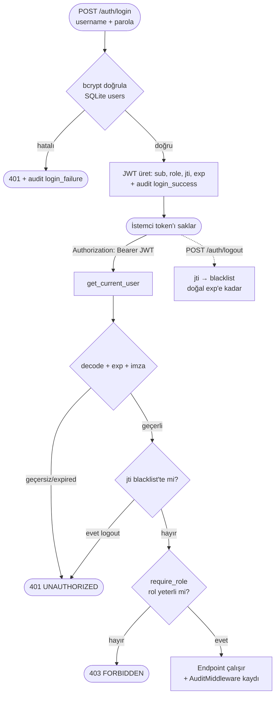

# Güvenlik (Security)

Bu belge sistemin güvenlik mimarisini ve önlemlerini açıklar.

## Katmanlar

1. **Input Validation** — `api/security.py`, prompt injection ve dangerous pattern tespiti
2. **Safety Classifier** — LLM tabanlı güvenlik sınıflandırması (Layer 1), **fail-closed**
3. **Output Validation** — üretilen script'lerde tehlikeli komut tespiti
4. **Authentication** — **JWT (HS256) + RBAC** (4 rol); `/auth/login`, logout=jti blacklist
5. **Authorization (RBAC)** — uç bazında `require_role(...)`; yetersiz rol → 403
6. **Audit Log** — SQLite `audit_log` (kim-ne-zaman); `AuditMiddleware` + login/logout
7. **Rate Limiting** — **kullanıcı-bazlı** (`user:{name}`) veya IP (Redis-backed, graceful fallback)
8. **Security Headers** — XSS, clickjacking, MIME-sniffing koruması

### Kimlik Doğrulama + RBAC Akışı (Mermaid)

## Safety Classifier — Fail-Closed

Layer 1 güvenlik sınıflandırıcısı **fail-closed** çalışır: LLM çağrısı hata
verirse, kategori parse edilemezse veya geçersiz bir etiket dönerse sonuç
`unverified` olur ve istek **reddedilir** (`is_safe=False`). Böylece bir Groq
kesintisi güvenlik kapısını sessizce devre dışı bırakamaz.

Ayrıca kullanıcı girdisi sınıflandırma prompt'una `<USER_INPUT>` bloğu içinde,
"yalnızca veri olarak ele al" direktifiyle enjekte edilir ve delimiter-escape
denemeleri nötralize edilir (prompt injection savunması).

## Authentication — JWT + RBAC

`api/auth.py` → **JWT (HS256)** tabanlı kimlik. Kullanıcılar SQLite'ta
(`data/auth.db`, bcrypt hash); `POST /auth/login` parola doğrular ve `sub/role/jti/exp`
claim'li access token üretir (varsayılan 60 dk). Korumalı uçlar `Authorization:
Bearer <token>` ister (`get_current_user`); EventSource/SSE için `?access_token=`
query fallback'i de kabul edilir.

- **RBAC:** 4 rol (öneri formu) — `sysadmin / security / developer / end_user`.
  `require_role(*roller)` dependency'si uç bazında yetki dener; uymazsa `403 FORBIDDEN`.
  Matris: chat/rag → herkes; plan/artifact → dev+; harden/analytics/audit/v1 → security+.
- **Logout:** `POST /auth/logout` token `jti`'sini doğal son-kullanma anına kadar
  **blacklist**'e alır (Redis `SETEX` / in-memory fallback); sonraki kullanımda `401`.
- **Dev mode:** `JWT_SECRET` set değilse sabit dev-secret + 4 demo hesap seed'lenir
  (uyarı loglanır). Production'da `JWT_SECRET` (>=32 karakter) zorunludur.
- Health + `/docs` + `/auth/login` public kalır.

> Not: Eski `X-API-Key` shared-secret modeli kaldırıldı (sadece JWT).

## Audit Log — Kim, Ne Zaman, Ne Yaptı

`api/audit.py` → SQLite `audit_log` tablosu. `AuditMiddleware` her isteği
(gürültülü prob'lar hariç) kaydeder: `ts, username, role, action, endpoint, method,
status, ip, request_id`. Login başarı/başarısızlık ve logout açık olay olarak
yazılır. Yazım `asyncio.to_thread` ile (event-loop bloklanmaz); audit hatası asla
isteği düşürmez. Sorgu: `GET /api/audit` (yalnız sysadmin/security).

## Rate Limiting

`RateLimitMiddleware`: dakika/saat bazlı limit.
- **Redis-backed** (atomik INCR+EXPIRE) — `REDIS_URL`/config erişilebilirse;
  dağıtık ve restart'a dayanıklı. Redis hiccup'ta **fail-open** (altyapı sorunu
  tüm API'yi düşürmesin).
- Erişilemezse **in-memory** fallback (process-local).
- **Kullanıcı-bazlı kota:** geçerli JWT varsa anahtar `user:{username}` (IP'den
  bağımsız — NAT/paylaşılan-IP arkasında adil); token yoksa `ip:{ip}`'ye düşer.
- İstemci IP'si varsayılan olarak gerçek peer adresinden alınır; `X-Forwarded-For`
  yalnızca `TRUST_PROXY=1` (bilinen LB arkasında) ise güvenilir (IP spoofing'e karşı).
- Limit aşımında standart `{"error": {...}}` şeması + `Retry-After` başlığı.

## LLM Sağlayıcı Güvenilirliği

- **Timeout + retry:** Groq/OpenAI SDK çağrıları `timeout` ve `max_retries` ile;
  429/5xx'te exponential backoff + `Retry-After` başlığına uyum.
- **Fallback zinciri:** birincil sağlayıcı düşerse sırayla diğerlerine geçilir
  (Groq → Novita → OpenAI → Ollama); hepsi düşerse anlamlı hata yükseltilir
  (sessiz boş cevap dönmez).

## CORS / Trusted Host

- CORS origin'leri `config.json`'dan okunur; wildcard (`*`) origin'de
  `allow_credentials` otomatik kapatılır (güvensiz kombinasyon engellenir).
- `TrustedHostMiddleware` `ALLOWED_HOSTS` env ile kısıtlanabilir.
- Her iki wildcard durumunda startup'ta uyarı loglanır.
- **Not:** Varsayılan dağıtım açık bırakılmıştır; production'da `ALLOWED_HOSTS` ve
  spesifik CORS origin'leri ayarlanmalıdır.

## Hata Yönetimi — Sızıntı Yok

Tüm router catch-all'ları `raise_internal_error` kullanır: gerçek exception
**yalnızca sunucu loguna** yazılır (request_id ile korele), client'a sadece
jenerik mesaj + request_id döner. Stack trace / iç detay / secret sızmaz.

## Bilinen Kısıtlar / Yapılacaklar

- JWT scope'u **Standart**: self-register ve refresh token yok (token süresi dolunca
  yeniden login). Kullanıcı yönetimi seeding + (gerekirse) elle ekleme ile yapılır.
- Blacklist Redis erişilemezse **fail-open** (token yine de exp ile düşer).
- CORS/TrustedHost varsayılanı açık — production öncesi kısıtlanmalı.

## ⚠️ API Anahtarı Sızıntısı — Rotasyon Runbook (PUBLIC'E AÇMADAN ÖNCE)

**Durum:** `.env` git GEÇMİŞİNDE commit'lenmiş (`0b5ca14 ".env yüklendi"`). Şu an `.env`
`.gitignore`'da (artık izli değil) ve `.env.example` temiz (gerçek değer yok). ANCAK gerçek
anahtarlar geçmiş commit'lerde duruyor — repo public'e açılırsa veya geçmişe erişen biri
olursa **sızar**. Sızan anahtarlar: Cerebras, SambaNova, OpenRouter, Novita, Qdrant
(+ Gmail SMTP app-password, AUTH_*/JWT_SECRET, VPS parolaları varsa).

**Yapılması gerekenler (sırayla):**

1. **Anahtarları ROTATE et** (her sağlayıcının dashboard'ında — bu adım elle yapılır):
   - Cerebras: console → API Keys → eski anahtarı **revoke**, yeni oluştur.
   - SambaNova Cloud: API Keys → revoke + yeni.
   - OpenRouter: Keys → eski anahtarı sil, yeni.
   - Novita: Key Management → revoke + yeni.
   - Qdrant Cloud: cluster → API Key → rotate.
   - Gmail SMTP: Google Account → App Passwords → eski app-password'ü **sil**, yeni üret.
   - `JWT_SECRET` / `AUTH_*_PASSWORD`: yenile (JWT_SECRET değişince tüm mevcut token'lar düşer — beklenen).
2. **Yeni anahtarları yalnız `.env`'e** yaz (asla commit etme — `.gitignore` zaten koruyor).
3. **Git geçmişini temizle** (public'e açmadan önce, opsiyonel ama önerilir):
   `git filter-repo --path .env --invert-paths` (veya BFG) → tüm geçmişten `.env`'i siler.
   Sonra force-push gerekir; ekiple (Engin) koordine et çünkü herkesin re-clone'u gerekir.
   > NOT: history rewrite YIKICI — yalnız anahtarlar rotate edildikten SONRA ve ekip onayıyla.
4. Doğrula: `git log --all --diff-filter=A -- .env` → boş dönmeli (temizlik sonrası).

**Önemli:** Eski anahtarlar rotate edildikten sonra geçmişteki kopyaları zararsızdır (artık
geçersiz). O yüzden **önce rotasyon, sonra (isteğe bağlı) history temizliği**.
